# karatsu-line-trip-2024-2

## 唐津線3駅探検その2 - 中多久駅

### まえがき

前回：[唐津線3駅探検その1 - 厳木駅](https://blog.aotake91.net/posts/20240212-karatsu-line-trip-2024-1/)

母方祖父が国鉄職員として勤めた唐津線の駅をまわった旅（2024年2月11日（日曜日））
の紹介、第2回目は<ruby>中多久<rp>（</rp><rt>なかたく</rt><rp>）</rp></ruby>駅で
す。

### 訪問ルート

唐津線内で乗降した区間だけを示します。駅めぐりには『旅名人の九州満喫きっぷ』1回
分を利用しました。

| 列車番号 | 時刻                           | 車両（右側が西唐津方）    |
|:--------:|--------------------------------|---------------------------|
|   5831D  | 佐賀（11:02）→厳木（11:40）   | キハ125-8 + キハ125-4     |
|   5832D  | 厳木（12:18）→中多久（12:29） | キハ47 8132 + キハ47 8157 |
|   5833D  | 中多久（12:52）→山本（13:24） | キハ47 8134 + キハ47 8062 |
|   5836D  | 山本（13:59）→小城（14:42）   | キハ47 9126 + キハ125-7   |

* * *

### 中多久駅

中多久駅は佐賀県の多久市にあります。市内にある3駅（東多久・中多久・多久）の中で、
『中』の一字が表す通り、多久市の中心街や市役所に最も近い駅となっています。

中多久駅もまた、祖父が勤めていた駅のひとつです。祖父自身の記録によれば、国鉄を
定年退職後、国鉄の駅務を受託する会社（日本交通観光社）に入って最初に担当したの
が中多久駅とのことでした。中多久駅の次に前回紹介した厳木駅の駅長になっています。

※写真をクリックすると拡大できます。

<section class="photo-area">
    <section class="photo">
        <a href="img/20240211_101.jpg">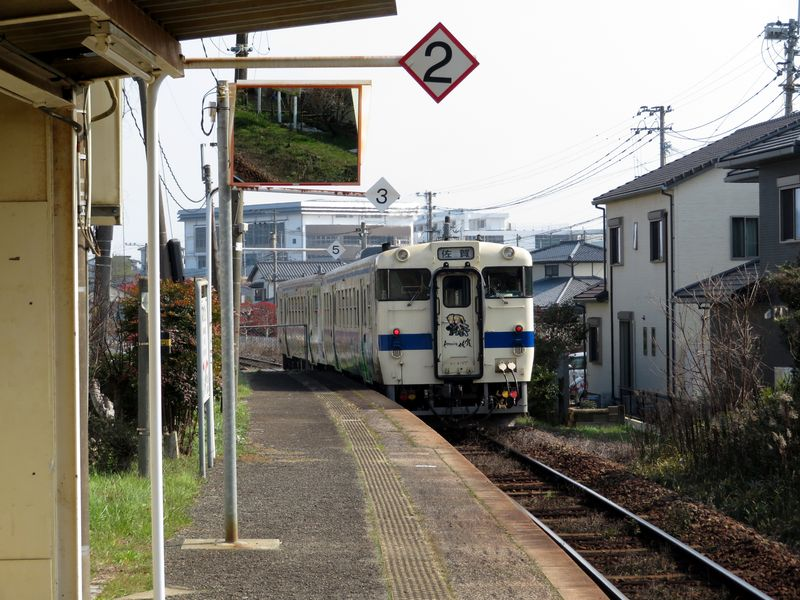</a>
    </section>
    <section class="photo-description">
        

        厳木駅から中多久駅までは笹原峠と多久駅を挟んで2駅、約11分です。佐賀行の列車から降りたのは自分一人、乗客も1～2名いました。
        

    </section>
    <a href="img/20240211_102.jpg">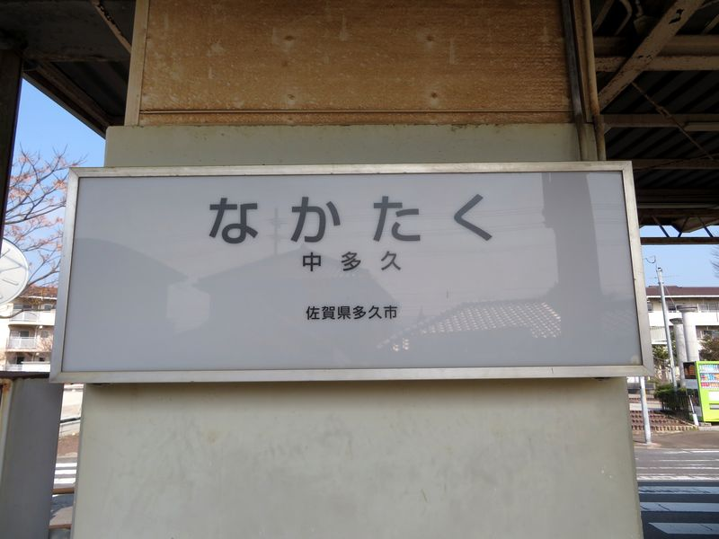</a>
    <section class="photo-description">
        

        中多久駅の小さなコンクリート製駅舎に行灯式の駅名標が取りつけられていますが、この駅名標には両隣の駅が書いてありません。2019年に訪問された方の写真では、国鉄時代の書体で中多久駅の駅名と両隣の駅名（多久・東多久）も書かれていたようですが、JR流のフォントに書き換えられた2020年の写真ではこの写真の通りとなっていました。単に駅名を表すためのものにしたようです。
        

    </section>
    <section class="photo">
        <a href="img/20240211_103.jpg">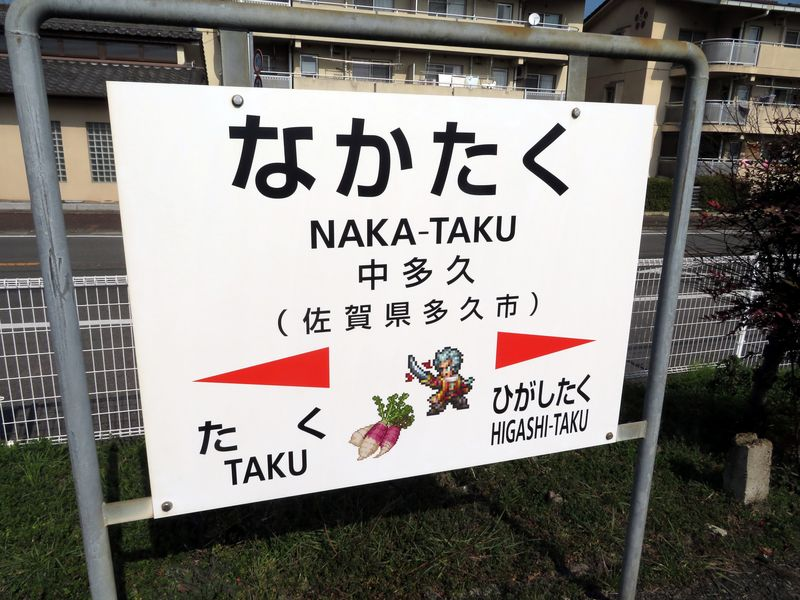</a>
    </section>
    <section class="photo-description">
        

        駅名標はあと2枚あります。佐賀寄りには「ロマンシング佐賀」仕様のものが設置されていました。ロマンシング佐賀タイアップの前はJR九州様式の駅名標だったようです。
        

        

        ロマンシング佐賀仕様の方に描かれている名産物は、多久市の伝統野菜「<ruby>女山<rp>（</rp><rt>おんなやま</rt><rp>）</rp></ruby>大根」だそうです。普通の青首大根よりも大ぶりで赤紫色の表皮を持ち、強い甘味があるのが特徴です。訪問した2月の時期が収穫期の最後の方にあたるようです。
        

        
※参考：<a href="http://www.otonari.co.jp/onnayama/">多久市商工会「女山大根 ―多久伝統野菜―」</a>

    </section>
    <section class="photo">
        <a href="img/20240211_104.jpg">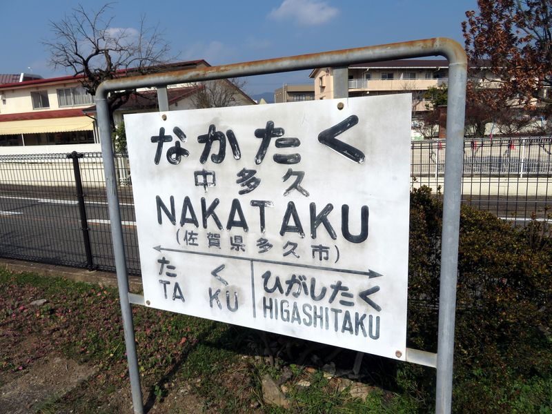</a>
    </section>
    <section class="photo-description">
        

        もうひとつの駅名標は年季の入った国鉄様式です。今まで国鉄式の駅名標をよく眺めたことがありませんでしたが、漢字よりもローマ字が大きくなっています。
        

    </section>
    <section class="photo">
        <a href="img/20240211_105.jpg">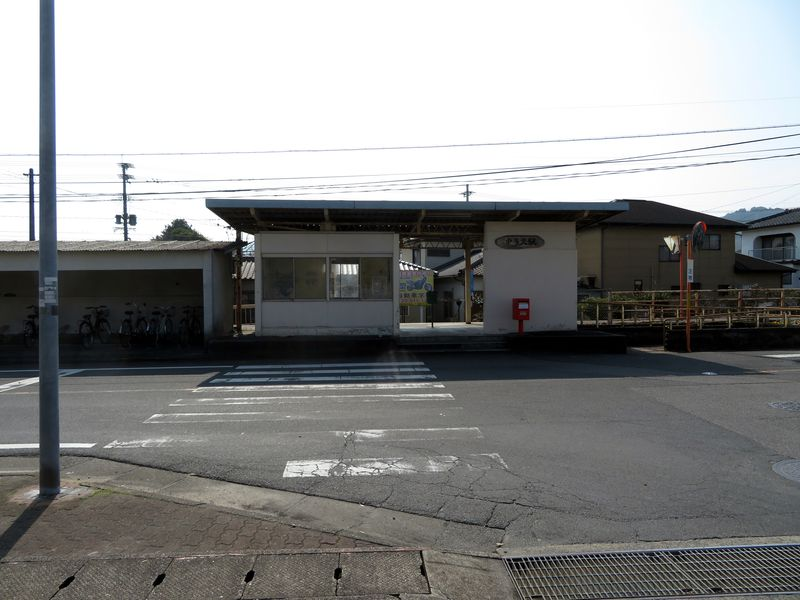</a>
    </section>
    <section class="photo-description">
        

        中多久駅の駅舎は1964年（昭和39年）4月1日の開業以来のものとのことです。駅名の洒落た看板は2013年頃には既に取り付けられていたようです。
        

        

        駅前には横断歩道と交差点があり、駅舎の側には空間がありません。
        

    </section>
    <section class="photo">
        <a href="img/20240211_106.jpg">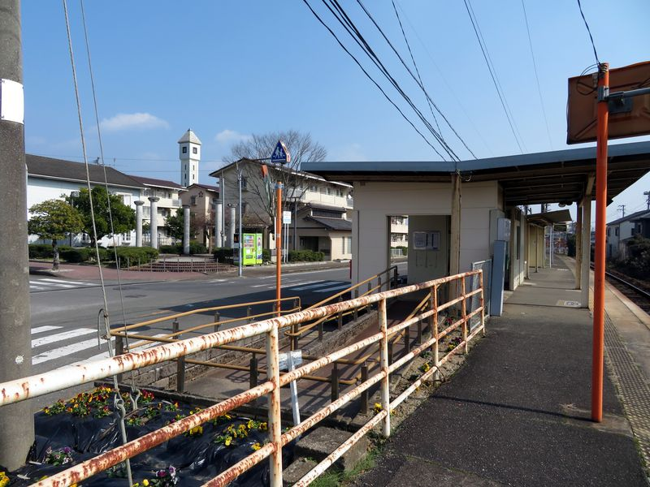</a>
    </section>
    <section class="photo-description">
        

        道を挟んで反対側に広場や自販機、新しめの公衆トイレがあります。駅前は団地が広がっていて、唐津線の各駅の中でも『街』を感じられる駅です。
        

    </section>
    <section class="photo">
        <a href="img/20240211_113.jpg">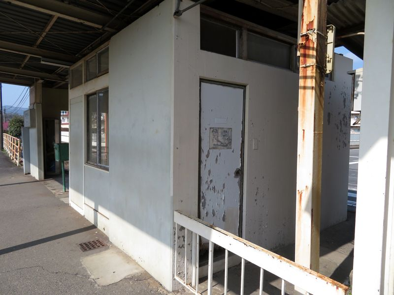</a>
    </section>
    <section class="photo-description">
        

        駅舎の外から入れるような位置に謎のドアがあります。この次の写真から分かるように、ここは駅舎内へは通じていません。おそらく古いトイレだろうと思われます。破れた古い張り紙からは老朽化のため閉鎖したと読み取れます。トイレは道を挟んで向かい側にとても綺麗なものがあるので、特段の影響はありません。
        

    </section>
    <section class="photo">
        <a href="img/20240211_107.jpg">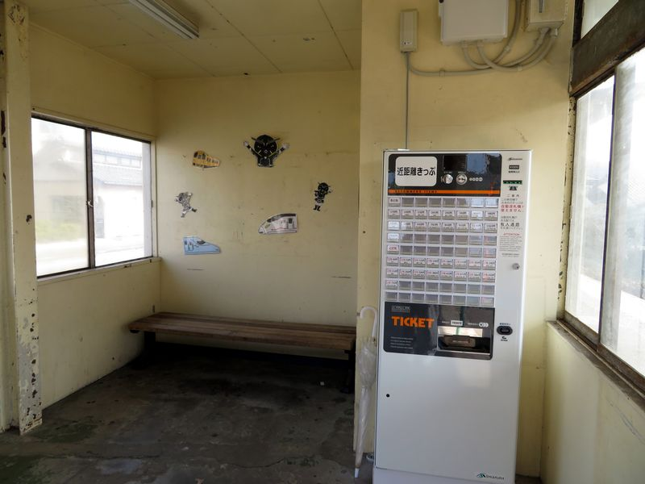</a>
    </section>
    <section class="photo-description">
        

        駅舎内はやや殺風景で、ベンチがひとつと券売機が1台あります。壁面は車両やそれをモチーフにしたキャラクターのイラストが貼られていました。
        

        

        インターネット上で古い写真を見つけたので観察したところ、この待合室のような区画はもともと駅務室であったようです。
        

        
参考サイト：<a href="https://www.monoqlophoto.com/">モノフォトショップ 添田カメラ</a>

    </section>
    <section class="photo">
        <a href="img/20240211_108.jpg">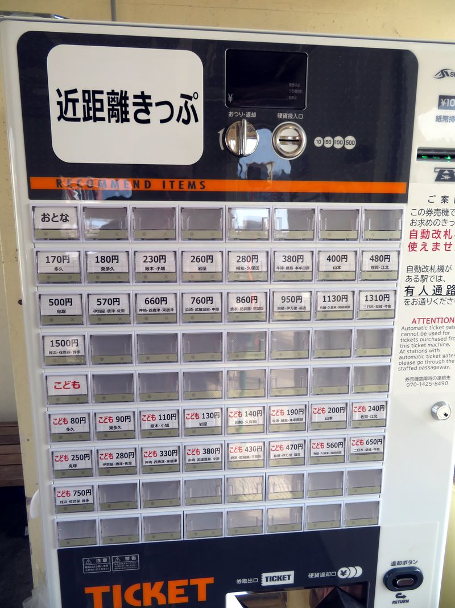</a>
    </section>
    <section class="photo-description">
        

        機械の表記によれば、この券売機は芝浦自販機株式会社の券売機（<a href="https://www.shibaura.co.jp/smv/products/kenbaiki/kenbaiki_05.html">KB-172NNSシリーズ</a>）のようです。大人片道1,500円の範囲をボタンに用意（口座収容）しています。その運賃となる主な駅も各ボタンの下段に示されています。
        

        

        券売機右側の注意書きに「自動改札機が使えません」とあるように、この券売機で発売される乗車券は磁気式の乗車券ではありません。お店の食券を想像すると分かりやすいかと思います。
        

        

        もともと中多久駅には磁気式乗車券を出す近距離きっぷの券売機が設置されていましたが、2022年春頃に撤去されていました。こちらの自販機が据え付けられたのが昨年秋頃だと聞いています。撤去から再設置まで1年半空いている理由は不明です。
        

    </section>
    <section class="photo">
        <a href="img/20240211_109.jpg">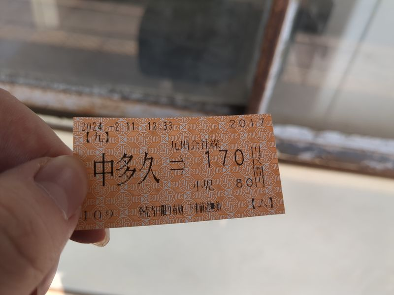</a>
    </section>
    <section class="photo-description">
        

        「旅名人の九州満喫きっぷ」を利用しているのできっぷを改めて買う必要性はありませんが、記念に1枚大人最安値のものを買ってみました。
        

        

        日本語のフォントは明朝体、数値はゴシック体を使っています。近距離きっぷの様式の通り、発駅と運賃、会社名と略号、各種注記が印字されています。注記のうち、右下の【ム】とは『普通乗車券の特殊発売』の取り扱いを示すものです。
        

        

        『普通乗車券の特殊発売』は、JR各社の「旅客営業規則」第27条に定めているものです。乗車券発売設備の制約上、利用客の最終着駅までの乗車券を発売できない場合に、途中駅（発売可能な最遠方の駅か、列車を乗り継ぐ駅）までの乗車券を発売して、途中駅で差額精算により最終着駅までの乗車券を発売する取り扱いを定めたものです。途中まで発売したことを示す記号が【ム】（規定本来の表記は○ム、丸の中にムを表記）です。
        

        

        通常、JRの中長距離利用の場合、乗車券に書かれた駅よりも先に行く場合は、その書かれた駅から目的地の駅までの運賃を別に支払うことになります。これだと乗車券の買い直しを強いられる客にとって不利益が大きいため、差額精算を実施するよう取り決めたものとなります。
        

        

        特殊発売の取り扱いは発売区間制限が時間を問わずある駅でのみ実施し、そうでない駅では基本的に設定をしないものとなっていましたが、昨今増えつつある、JR各社で見られる窓口営業時間帯の短縮が行われている駅では、近距離きっぷの券売機しか稼動せず、発売区間制限があるのと同等の状態になることがあるため、規則第27条第2項に「ただし、乗車券類発売機により発行する普通乗車券については表示を省略することがある。 」との一文が追加され、そうした時間帯無人駅でも事実上特殊発売の取り扱いをすることとなりました。（2023年9月20日九州旅客鉄道株式会社公告第12号、2023年10月1日より実施。他旅客鉄道各社も同様）
        

    </section>
    <section class="photo">
        <a href="img/20240211_110.jpg">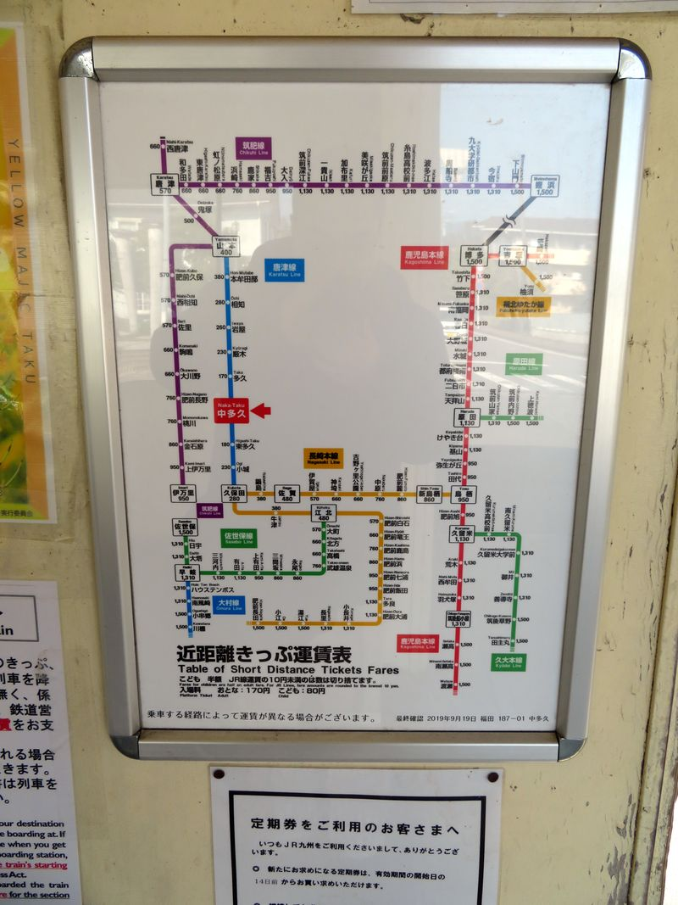</a>
    </section>
    <section class="photo-description">
        

        ……写真1枚に説明を長く加え過ぎましたが、運賃に関してもう少々お付き合いください。
        

        

        中多久駅の運賃表は、当駅から大人片道1,500円の範囲が記載されています。ちょうど駅券売機で買える範囲と等しくなっています。この範囲外の場合は、先の特殊発売の規定に基づき、行きたい方向の最遠方か列車を乗り継ぐ駅（ここでの乗継駅の一例：久保田、佐賀、唐津）までの乗車券を買って、乗り継ぐ駅で本来の乗車券を差額精算で作成することになります。
        

        

        この運賃表で特筆すべき点は、博多駅と姪浜駅の間に、路線名や途中駅を明示しない形で黒い線が引かれているところです。この黒い線に相当する路線は福岡市地下鉄空港線です。この線は博多駅へは佐賀回りだけでなく唐津回りでも行けることを教えてくれていますが、この表の運賃は<strong class="highlight">最も安くなる経路</strong>によって表示されているため、唐津回りだと1,800円（姪浜までの運賃に地下鉄線の姪浜～博多間の運賃を加算）になります。
        

        

        「せっかく線を引いているのに何で運賃が書いてないんだ、天神とか案内してついでに券売機のボタンに足しとけばええやろ？」と思う貴方への返信を以下に差し上げます。研究者やオタクは人から尋ねられると狂気乱舞してこれでもかと大量に喋り倒してドン引きされるものです。尋ねられなくても下記のように喋り倒してドン引きされます。結論から言うと「<strong class="highlight">姪浜駅までのきっぷを買っていれば地下鉄線内各駅での精算は自在にできるが、中多久駅（ほか近辺）で地下鉄線内着のきっぷを売る契約は福岡市交通局とはしていないから</strong>」です。
        

        

        福岡市地下鉄空港線は福岡市交通局が運営する路線で、JR九州とは別の事業者です。鉄道好きにとっては別事業者であることは自明ですが、地下鉄空港線と筑肥線（筑肥東線）の列車が相互直通運転をしていることから、沿線の人にとってはあまり意識されないところです。実際、その範囲内である西唐津～姪浜間と地下鉄の全駅との間は、券売機で区間を選択すると1枚の乗車券を買うことができます。これはJR九州と福岡市交通局が連絡運輸の契約を結んでいることによるものです。連絡運輸の契約により、乗車券を1枚にまとめて発売したり、西唐津～下山門（姪浜の1駅唐津方）間の区間内発着の乗車券を持ったまま地下鉄線内に行っても乗り越し精算が問題なくできたり、逆に地下鉄線内完結の乗車券を持って西唐津～下山門間の各駅に行っても精算ができます。
        

        

        福岡市交通局とJR九州の連絡運輸契約の中には、指定の範囲内の駅発着の場合に、地下鉄空港線の姪浜～博多間を挟む形でその前後のJR線の運賃を通算し、通算運賃に地下鉄区間分の運賃を足して乗車券を（JRが）発売する契約があります。これは連絡運輸制度の中でも特に「通過連絡運輸」と称されます。福岡市交通局が毎年公開する「<a href="https://subway.city.fukuoka.lg.jp/subway/about/material.php">福岡市地下鉄事業概要</a>」にその範囲が示されています。連絡運輸の範囲の表を普通乗車券について抜粋すると、
        

        <table style="margin-bottom: 1.5rem; width: 100%;">
            <caption>相互連絡運輸範囲</caption>
            <tr><th>着発駅1</th><th>着発駅2</th></tr>
            <tr><td>西唐津～唐津～下山門</td><td>地下鉄全線（全駅）</td></tr>
        </table>
        <table style="width: 100%;">
            <caption>通過連絡運輸範囲</caption>
            <tr><th>着発駅1（JR）</th><th>地下鉄区間</th><th>着発駅2（JR）</th></tr>
            <tr><td>筑肥線各駅</td><td class="bgcolor-subway">姪浜～博多</td><td>JR九州各駅（全駅）</td></tr>
            <tr><td>唐津線（西唐津～小城）</td><td class="bgcolor-subway"></td><td>JR西日本各駅（全駅）</td></tr>
            <tr><td></td><td class="bgcolor-subway"></td><td>JR四国各駅（全駅）</td></tr>
            <tr><td></td><td class="bgcolor-subway"></td><td>JR東海各駅（全駅）</td></tr>
        </table>
        

        となっています。中多久駅で地下鉄線内の運賃や駅の存在が特に書かれていないのは、もともと近距離きっぷの扱いとしては大人片道1,500円の範囲内で発売するというひとつの基準があることの他に、相互連絡運輸の範囲の外であるため乗車券を売れないという事情もあります。
        

        

        一方、通過連絡運輸の範囲には、筑肥東線区間と西唐津駅だけでなく、筑肥西線区間（山本～伊万里）と唐津線の残りの駅も含まれています。着発駅1に書かれた各駅から、地下鉄線を通過して着発駅2の範囲の各駅までの乗車券が窓口で買えます。JR東海の各駅が含まれているため、東海道新幹線経由で品川駅や東京駅まで買えます。実は東京駅まで買うと『東京都区内』までの乗車券となるため、秋葉原や上野や新宿や池袋まででもきっぷ1枚です<a href="#footnote1">※1</a>。
        

    </section>
    <section class="photo">
        <a href="img/20240211_111.jpg">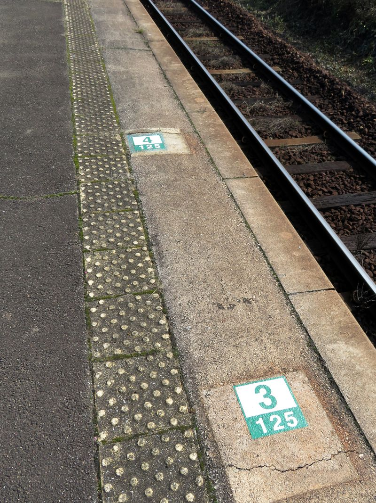</a>
    </section>
    <section class="photo-description">
        

        写真2枚相手に文字の羅列をやり過ぎました。反省はしません。気を取り直して次に行きます。
        

        

        中多久駅にも、厳木駅と同様の車掌向けのキハ125形用停止位置確認目標があります。しかし、なぜか4両編成に対する目標が、3両編成に対する目標より微妙に先の方にあります。なぜでしょう？
        

        

        テレビや配信ならばここでクイズタイムにするところですが、長文を連ねたオタク記事でクイズを出してこれ以上長くしてはつらいので答えを書きます。『3両と4両の停止位置目標が違うものの、その間隔がキハ125形の1両分よりも長いから』です。
        

    </section>
    <section class="photo">
        
        <a href="img/nakataku-stop-kiha125-4b.webp">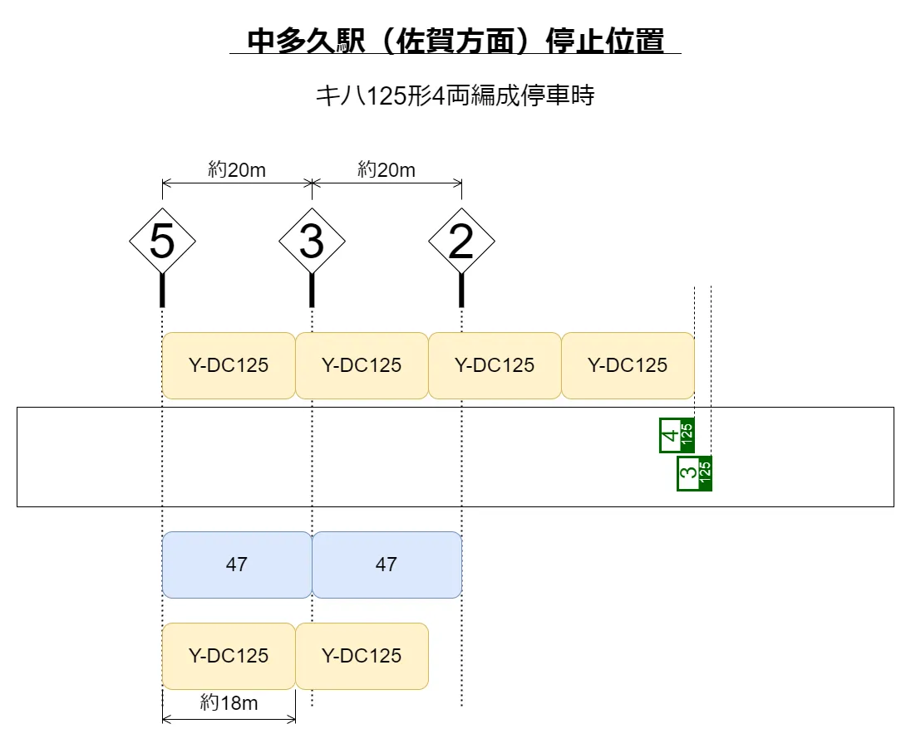</a>
    </section>
    <section class="photo-description">
        

        クリックして拡大すると分かりやすいかと思いますが、停止位置目標が20m級の車両を前提として置かれているところ、キハ125形ですと18m級であるため、中多久駅の場合は3両と4両では4両編成の方の最後部が3両編成の時より2mほど前に来てしまいます。
        

        

        そのため、後部停止位置確認目標もそれに見合うだけずらして置かないと、正しい停止位置目標に停止したのにオーバーランしたかのように見えてしまい、混乱のもととなります。そのため、一見不思議な確認目標の配置となりました。
        

        

        一昔前は結構大きく後部目標が描かれていて、その名残を写真に写っている妙に白いホーム面の四角い領域に見ることができます。
        

    </section>
    <section class="photo">
        <a href="img/20240211_112.jpg">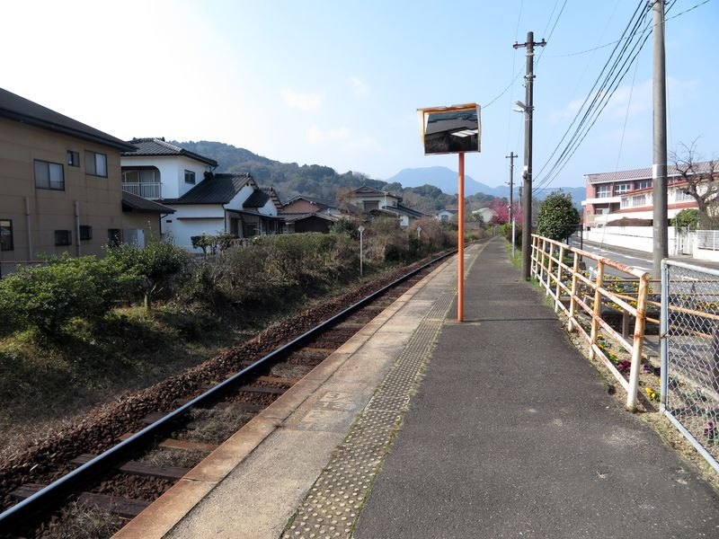</a>
    </section>
    <section class="photo-description">
        

        一回り大きかった頃の後部確認目標が、唐津方面のものは薄く残っています。写真にあるものは、奥が「3 / 4 | 125」、手前が「2 / (読めない) | 125」となっています。この表記の後部確認目標は編成中間の乗務員室から扉扱いを行う際のものであったと記憶しています。1枚目は『4両編成のうち3両目の後部』くらいの意味合いだったかと思います。
        

    </section>
    <section class="photo">
        <a href="img/20240211_114.jpg">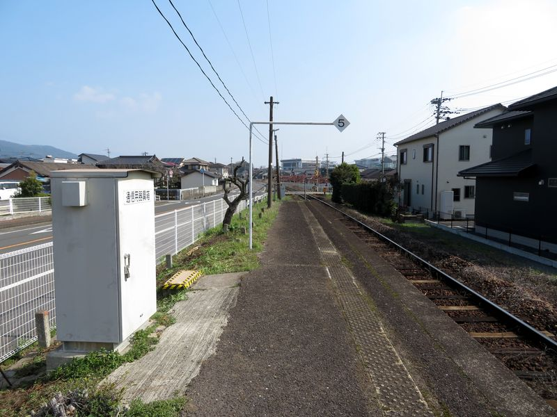</a>
    </section>
    <section class="photo-description">
        

        ホームの佐賀方端近くには『通信用器具箱』と書かれた箱があります。中身はよく分かりません。手前のコンクリート施工や奥のゼブラテープで囲われた部分から見るに、ケーブルは地下の方にありそうです。
        

    </section>
    <section class="photo">
        
    </section>
    <section class="photo-description">
        

        駅到着から23分で今度は西唐津行の5833Dが来ましたので、この列車で山本駅へ向かいました。
        

    </section>
</section>

* * *

備考

<ol id="footnotes">
    <li id="footnote1">JR東日本と福岡市交通局は現在連絡運輸の取り扱いが終了していますが、JR東海の新横浜駅、品川駅、東京駅が存在するためか、これら乗車券に対して特定都区市内制度の『横浜市内』駅、『東京都区内』駅発着が2024年現在も（例外的に？）適用され、その範囲内であればJR東日本の各駅も利用できるようです。なお、これらの乗車券購入が可能な横浜市内・東京都区内に存在する窓口はJR東海の新横浜駅・品川駅・東京駅だけです。
    </li>
</ul>
