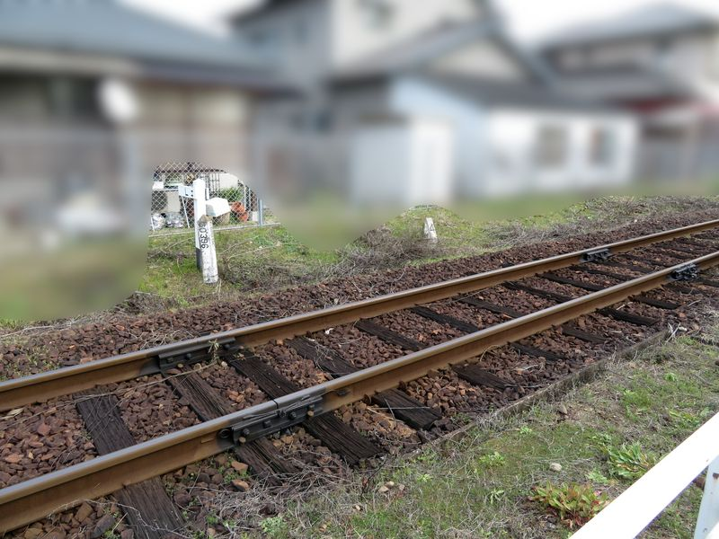

# karatsu-line-trip-2024-3

## 唐津線3駅探検その3 - 山本駅

### まえがき

* 前々回：[唐津線3駅探検その1 - 厳木駅](https://blog.aotake91.net/posts/20240212-karatsu-line-trip-2024-1/)
* 前回：[唐津線3駅探検その2 - 中多久駅](https://blog.aotake91.net/posts/20240215-karatsu-line-trip-2024-2/)

母方祖父が国鉄職員として勤めた唐津線の駅をまわった旅（2024年2月11日（日曜日））の紹介、
今回の最後・第3回目は<ruby>山本<rp>（</rp><rt>やまもと</rt><rp>）</rp></ruby>駅です。
山本駅は祖父が勤務した経歴はありませんが、古くは路線網の結節点として重要な役目を果たしていたので、
今回の訪問対象に入れました。

### 訪問ルート

唐津線内で乗降した区間だけを示します。駅めぐりには『旅名人の九州満喫きっぷ』1回分を利用しました。

| 列車番号 | 時刻                           | 車両（右側が西唐津方）    |
|:--------:|--------------------------------|---------------------------|
|   5831D  | 佐賀（11:02）→厳木（11:40）   | キハ125-8 + キハ125-4     |
|   5832D  | 厳木（12:18）→中多久（12:29） | キハ47 8132 + キハ47 8157 |
|   5833D  | 中多久（12:52）→山本（13:24） | キハ47 8134 + キハ47 8062 |
|   5836D  | 山本（13:59）→小城（14:42）   | キハ47 9126 + キハ125-7   |

* * *

### 山本駅

#### 山本駅略史

山本駅は佐賀県唐津市にあります。平成の大合併で唐津市の市域が大きく広がる前から唐津市に属し、
市街地からは南の方に5kmほど行ったところになります。

山本駅は、かつては唐津市における交通の一大結節点となっていました。
1898年（明治31年）に唐津線の前身・唐津興業鉄道が通じ<a href="#footnote1">※1</a>、
1929年（昭和4年）に現在の筑肥線の前身である北九州鉄道の路線がここまで延びてきて乗り換え拠点となりました<a href="#footnote2">※2</a>。

唐津市内を流れる松浦川が河口付近で急に流路が広くなり、その地点での架橋が難しかったことから、
山本駅付近で川を渡るように線路が敷かれた結果、唐津市の鉄道の拠点は市街地に最も近い唐津駅（唐津線）、
博多からできる限り市街地に近づいた東唐津駅（旧駅・筑肥線）、
両路線の乗り換えができる山本駅の3つに分かれた状態が長く続きました。

その後、鉄建公団呼子線（虹ノ松原～唐津～呼子）の工事が実施され、
呼子線自体は国鉄再建法施行により工事凍結となったのですが、工事区間のうち虹ノ松原～唐津間は筑肥線の付け替え名目で工事が継続され、
1983年（昭和58年）に筑肥線が唐津駅の方へつながったことから、山本駅のターミナル的な役目は終わりました。
今でも駅構内は広く、一部にはかつてターミナル駅であったことを思わせる遺構もあります。

#### 写真

※写真をクリックすると拡大できます。

<section class="photo-area">
    <section class="photo">
        
    </section>
    <section class="photo-description">
        

        中多久駅から乗ってきた列車を山本駅で下車したのは自分だけでした。かつてはもっと広かった構内は、今は2面3線の構造となっています。
        

        

        この写真は去り行く列車を撮るために少し望遠にして撮っています。コンパクトデジタルカメラが流行らなくなって久しく、製品自体が新規に出なくなっているのは残念です。自分の持つコンパクトデジタルカメラは、取り回しの良さと高倍率ズームの機能が大変嬉しく、スマートフォンの望遠カメラや光学ズームで思うような撮影が難しい場面、一眼カメラだと大仰になりがちな場面で活躍してくれます。
        

    </section>
    <section class="photo">
        
    </section>
    <section class="photo-description">
        

        反対側を向いて、唐津線佐賀方・筑肥線（運転取扱上の通称は『筑肥西線』）伊万里方を望みます。望遠にして家などを画角の外に追い出して田畑の方に向けて撮ると、この写真のように侘びしさを覚えるような感じが出たりします。
        

        

        写真に写る出発信号機4基を説明します。いずれも3灯式の灯器を用いていますが、中央部は板で塞がれており、停止現示と進行現示のみが現示できます。
        

        <ul style="margin: 0 auto;">
            <li>（左側）3番線【筑肥線】伊万里方出発信号機</li>
            <li>（中央下段）2番線伊万里方（筑肥線）出発信号機</li>
            <li>（中央上段）2番線佐賀方（唐津線）出発信号機</li>
            <li>（右側）1番線【唐津線】佐賀方出発信号機</li>
        </ul>
        

        2番線のみ、唐津線と筑肥線の両方への進出が可能です。3番線の信号機は2番線の下段の信号機と同じ高さにあります。上に点検台が残っており、かつて唐津線佐賀方への出発信号機があったことを伝えています。2005年（平成17年）頃には3番線から唐津線佐賀方へ進出するための渡り線があったようですが<a href="#footnote3">※3</a>、その時点ですでに進路および信号機は使用停止とされていたようです。その後撤去されて今の形になっています。
        

    </section>
    <section class="photo">
        
    </section>
    <section class="photo-description">
        

        ズームをしない（広角側の端）で撮ると構内の広さを表現できます。この写真は35mm換算で焦点距離24mmです。駅舎前付近から唐津方を見たものになります。
        

    </section>
    <section class="photo">
        
    </section>
    <section class="photo-description">
        

        先ほど見た佐賀・伊万里方を同じく焦点距離24mmで写すとこのような感じになります。信号機がとても遠くなりました。ここは実際に撮影地点から230mくらい先に信号機があるので、撮影技法による誇張効果だけではなく本当に遠いです。
        

        

        人の目で見た感覚の写り方に近いのは35mm換算での焦点距離50mmの時ですが、このカメラをはじめとするコンパクトデジタルカメラは焦点距離の数字を見て合わせるタイプのズームではなく、ズーム時の目安のゲージと撮影範囲の画面を見て撮って、後でEXIF情報を見たら実際の焦点距離がどうだったか分かるタイプの作りがほとんどなので、50mm前後に厳密に合わせることはできませんし、そこまでやりたいなら一眼カメラなどを使うのが良いです。
        

    </section>
    <section class="photo">
        
    </section>
    <section class="photo-description">
        

        山本駅には大変立派な駅舎が残っています。1912年（大正元年）に作られたものとのことです。ちょうど同じ年に唐津線<ruby>岸嶽<rp>（</rp><rt>きしたけ</rt><rp>）</rp></ruby>支線が当駅から北波多村（当時）の岸嶽駅まで開業しています。
        

        

        かつては大変賑わい、その当時の写真もインターネット上などに残されていますが、今はひっそりとしていました。自分がいた時間帯にこの駅を訪れていた人は、自分が下車した時にすでに駅にいた鉄道ファンと思しき人1名と、自分が列車で小城駅に出発する直前に駅に来て、唐津駅へ行く列車が出るホームを尋ねてきた中国か台湾からの旅行客3名くらいでした。
        

    </section>
    <section class="photo">
        
    </section>
    <section class="photo-description">
        

        駅舎を駅構内から見ます。改札正面に2番・3番ホームへの構内通路があります。通路の途中で若干舗装が変わって見える位置が、かつてホームがない着発線があった場所と思われます。駅舎をこちら側から見て改札口の左側、もとの駅務室スペースも出入口が板などで厳重に塞がれるということはなく、普通に存在しています。
        

    </section>
    <section class="photo">
        
    </section>
    <section class="photo-description">
        

        さらに2番・3番ホーム側から駅舎を見ます。1番ホームの構内通路の部分から唐津方は柵で閉鎖されています。駅舎の屋根が張り出している作りに『停車場（ステイシヨン）』の雰囲気を感じます。似た作りの駅舎は唐津線内だと小城駅にもありますが、あちらが綺麗に補修された一方、こちらは少々老朽化が目立ちます。
        

    </section>
    <section class="photo">
        
    </section>
    <section class="photo-description">
        

        張り出している部分を外から撮ったものがこの写真です。綺麗に直してくれるといいなと思いつつ眺めていました。
        

    </section>
    <section class="photo-2column">
        
        
    </section>
    <section class="photo-description">
        

        駅舎入口の駅名標は立派なものが掛かっています。その右端近くの柱には、国鉄の建造物に必ず取り付けられる「建物財産標」がきちんと残っていました。写真をクリックすると拡大できます。記載内容を文字起こしして表現すると、
        

<pre style="background-color: #EFEFEF; border: 1px solid black; width: fit-content; padding: 1rem;">
建物財産標
    鉄
本屋建第1号
山本駅本屋
大正1.10.4
</pre>
        となっていました。
    </section>
    <section class="photo">
        
    </section>
    <section class="photo-description">
        

        山本駅の出札窓口（きっぷ売り場）跡です。1985年（昭和60年）1月20日に無人駅となっていますが、<ruby>厳木<rp>（</rp><rt>きゅうらぎ</rt><rp>）</rp></ruby>駅とは違ってこちらは全面を塞がれているわけではなく、接客用の設備（声を通すために穴開き加工されている部分やきっぷ等のやり取りをするための開口部）があった部分だけを塞いでいるようです。
        

        

        塞がれた部分には運賃表が掲示されています。また、写真右端の方に写っている掲示板には「乗車するお客様へ」と書かれた日英2か国語による掲示があり、その中のQRコードを読み取ると乗車駅証明書を発行できるサービスがあるとの記載がされていました。
        

        

        ただ、山本駅には自動券売機（だいぶ前から各駅に置かれているタイプの磁気券が出るもの）がありますし、ここを発着する唐津線と筑肥線（筑肥西線）の列車はワンマン運転ならば全列車が車内で乗車駅証明書を整理券の形で発行していて、ツーマン運転ならば車掌から乗車券類を購入できますので、乗車駅証明書発行サービスの出る幕は無さそうです。
        

    </section>
    <section class="photo">
        
    </section>
    <section class="photo-description">
        

        運賃表には山本駅から大人片道1,130円の範囲が記載されています。しかし、後述する自動券売機の口座には、2段階分先の運賃帯である大人片道1,500円の範囲まで入っていて、ボタンにもその運賃帯の最遠方の駅が記載されています。1,130円までしか運賃表に書かなかったのは、おそらく姪浜駅と福岡市地下鉄空港線の存在、また福岡市交通局との連絡運輸の適用範囲のためではないかと推測しています。
        

        

        山本駅は前回の中多久駅の記事で述べた通り、福岡市交通局との（相互）連絡運輸の範囲外であるため、姪浜駅から先の地下鉄線内着となる連絡乗車券は発売できません。その代わりに、姪浜駅までの乗車券を持った状態で地下鉄線内にそのまま進み、着駅で姪浜駅からの地下鉄区間の運賃を精算して出場することができます<a href="#footnote4">※4</a>。
        

        

        しかしややこしいことに、山本駅は福岡市地下鉄空港線を介したJR各線（九州会社線・西日本会社線・四国会社線・東海会社線）への通過連絡運輸の範囲内の駅ではあるため、博多駅を通り越してJR各線に乗り換える形の乗車券は買うことができ、山本駅の自動券売機にもその口座が2つ用意されています。そして、そのうちの1つのボタンは博多駅までの運賃とも同額にはなってしまい<a href="#footnote5">※5</a>、そのあたりの事情をこの1枚の表で全部表現しようとすると一般の客が見ても何を書いているか全く分からず、福岡市高速鉄道連絡運輸規程（福岡市交通事業管理規程第5号）を知っているオタクか、JR九州（ただし唐津管内に限る）と福岡市地下鉄の駅員さんにしか読み解けないシロモノができてしまいます。それならいっそバッサリ切ってしまって、券売機に書いてある駅の場所が分かる人に提供し、あとは着駅で精算してもろて……、とするのもひとつの策ではあります。
        

    </section>
    <section class="photo">
        
    </section>
    <section class="photo-description">
        

        改札口の跡の方を見ます。左脇に転倒防止補強がされた自動券売機があります。さらに山本駅の駅舎構造模型や模写なども展示されています。改札口跡の上には時刻表か表示板があったような跡がありますが、このあたりは補修を頼みたいところです。
        

    </section>
    <section class="photo">
        
    </section>
    <section class="photo-description">
        

        こちらが先ほどグダグダ述べたことにかかわる自動券売機です。大人片道1,500円の区間までの普通乗車券を発売しています。最遠方は有田駅（佐世保線）、久留米駅・基山駅（鹿児島本線）となります。なお、有田駅へは筑肥線を利用して伊万里へ行き、伊万里から松浦鉄道で向かった方が安くて速いです<a href="#footnote6">※6</a>。（山本～伊万里間570円、伊万里～有田間460円、計1,030円）
        

        

        最下段には薄い緑色の地色で運賃と駅名が書かれたボタンが2つあります。こちらは筑肥線（筑肥東線）・福岡市地下鉄空港線経由で博多駅まで行き、そこから先のJRの各駅までの乗車券が買えるボタンです。左側が1,430円のボタン（「香椎・吉塚・南福岡」の表記）、右側が1,610円のボタン（「古賀・二日市・篠栗」の表記）となります。唐津線佐賀経由でこれらの駅までの乗車券は買えません（券売機の運賃より高くなります）ので、1,500円の乗車券を買って乗り越し精算（差額精算）となります。
        

        

        1つ目のボタンが空港線の前後のJR区間の通算が運賃計算キロで51～60km・1,130円の区間、2つ目のボタンがJR区間の通算の運賃計算キロが61～70km・1,310円の区間に対応しています。山本～唐津～姪浜の運賃計算キロが50.7km（切り上げて51km）であるため、博多から先の営業キロがそれぞれ9.3km（鹿児島本線下り大野城、上り香椎、篠栗線長者原まで）、19.3km（鹿児島本線下り天拝山、上り古賀、篠栗線城戸南蔵院前、篠栗線長者原経由で香椎線宇美、鹿児島本線香椎経由で香椎線雁ノ巣まで）以内の範囲で有効な乗車券が買えることになります。
        

    </section>
    <section class="photo">
        
    </section>
    <section class="photo-description">
        

        山本駅前にも、厳木駅前と同様に国土交通省九州地方整備局（佐賀国道事務所唐津維持出張所）管理の自転車駐車場が設置されています。ここの前の道は今も立派な国道203号です。無限に車が通行しています。国道203号に並行する高規格道路「佐賀唐津道路」を成すことになる新道がまだここまでは延びておらず、すでに1973年（昭和48年）の事業開始から51年が経過してなお、この山本地区を含む唐津相知道路【唐津IC（西九州自動車道接続）～<ruby>相知長部田<rp>（</rp><rt>おうちながへた</rt><rp>）</rp>IC</ruby>間】は事業化の目処は立っていないとのことです。
        

        

        もし地域高規格道路がただちに実現したとして、唐津線の利用客に影響があるかどうかですが、もうこのあたりでは自動車の運転ができる人はみんな自動車利用に移っているので、影響は起こらないのではないかと思っています。今回乗った列車はいずれも普段使いのお客さんが多く乗っていましたし、鉄道が必要な人による需要が安定して存在し、かつ満たされている段階かなと思いました。とはいえ、それが施設補修や運行維持に足りているかどうかは分かりません。
        

    </section>
    <section class="photo">
        
    </section>
    <section class="photo-description">
        

        駅前には唐津でおなじみ、昭和バスの「山本」バス停が設置されています。『駅前』が付かず、駅名と同じ広域の地名を名乗るバス停は格調高さがあります（小社調べ）。写真は道を挟んで向かいにある唐津（大手口）方面、および伊万里からの高速バス「いまり号」福岡（天神・博多・福岡空港）行が発着する方のバス停です。この写真の左手方向に少し行ったところに、唐津-佐賀線の多久・小城・佐賀方面、久里・北波多線の北波多（市民病院きたはた）行、「いまり号」伊万里行のバスが発着するバス停があります。
        

        

        高速バス「いまり号」は13往復<a href="#footnote7">※7</a>あり、山本から福岡方面は天神まで約1時間15分・1,100円、博多駅（博多バスターミナル）まで約1時間30分・1,100円、福岡空港まで約1時間45分～2時間・1,250円で行けます。もちろん交通系ICカードが使え、nimocaなら5%ポイントがつきます。お得な回数券もあります。
        

        

        つまるところ、ここ山本、あるいは伊万里から天神や博多駅までなら、高速バスの方が安くて速いことになります。福岡発は西鉄天神高速バスターミナルに乗り入れる関係上、あらゆるバスの時間を食い尽くす魔境・渡辺通りを通過しなければなりませんが、福岡行は昭和通りに曲がって天神日銀前到着→博多バスターミナル直行となるので時間が読みやすいです。かつて筑肥線が担った福岡方面直通需要の多くは、この「いまり号」、あるいは唐津（大手口）発着の「からつ号」が代替した感があります。
        

    </section>
    <section class="photo">
        
    </section>
    <section class="photo-description">
        

        脱線し過ぎましたので気を取り直して駅構内の見物に戻ります。1番ホームには古くからの番線標として四角い「1」の札がついています。その右手にはカラーの駅名標があります。この日は遠くから撮って満足していましたが、後から写真を見返したところ、あれが山本駅唯一の「ロマンシング佐賀」仕様の駅名標だと判明したので後日また見に行きます。ずっと奥（写真左手）の方には国鉄仕様の駅名標もありました。
        

        

        白い柵の向こう側には保守用のモーターカーとバラストを入れるホッパ車が留置されていました。あの場所がかつて唐津線岸嶽支線が発着していた0番ホームとその着発線だそうです。
        

    </section>
    <section class="photo">
        
    </section>
    <section class="photo-description">
        

        2番・3番ホームです。構内踏切を渡ってきたところに番線標があります。こちらは確実に行灯式です。すぐ右手側には新しい家がいくつも建っていて、金網の先にもまだ筑肥線博多方面のホームと線路が並んでいた時代は現地の光景からは想像できません。
        

    </section>
    <section class="photo">
        
    </section>
    <section class="photo-description">
        

        1番ホームの方を見ると、金網で閉鎖されたところから先の方にコンクリート製の建物があります。山本駅の信通機器室です。連動装置やCTC駅装置、閉塞装置が置かれているのは確実として、各駅へのCTC回線関係の設備や列車無線関係の装置も入っているんでしょうか。実際に転轍機や信号を取り扱うための連動制御盤は古い駅舎の方にあると思います。
        

    </section>
    <section class="photo">
        
    </section>
    <section class="photo-description">
        

        ホーム上の待合室に時刻表が貼られています。唐津方面の発車ホームは、唐津線佐賀方からの列車が1番ホーム、筑肥線伊万里方からの列車が3番ホームとなっています。唐津線佐賀方面は2番ホーム発で統一、筑肥線伊万里方面は9本中6本が2番ホーム発、佐賀行の列車が近接している時は誤乗防止対策なのか3番ホーム発となっています。構内配線の都合上、唐津・西唐津行の列車の着発線を揃えられないのですが、伊万里からの列車と佐賀行の列車の2・3番対面接続もあったりするので、1番線への渡り線を作ってもあまり使う機会がないかもしれません。
        

    </section>
    <section class="photo">
        
    </section>
    <section class="photo-description">
        

        待合室の唐津方に柱があります。いかにもここにかつて上屋があったという感を醸し出しており、実際に上屋があった写真を個人の方の写真集ウェブサイト<a href="#footnote3">※3</a>で見つけることができました。この柱は今は2番線・3番線の唐津方の出発信号機に対する出発反応標識（レピーター）と、接近放送・遠隔放送用のスピーカーの取り付け柱として新たな任務を果たしています。
        

        

        ……この柱の奥、左手2番線側の2両編成停止位置目標ですが、よく見ると90度回転した状態で「2」の数字が薄く映っています。謎です。
        

    </section>
    <section class="photo">
        
    </section>
    <section class="photo-description">
        

        その謎の停止位置目標が大きく写った写真をどうぞ。おそらく古き良きフォントでレタリングするための材料が失われていて、綺麗にする時に古い板を使い回したものの、同じ上下方向で重ねて印刷するとグチャグチャになるので横に回したんじゃないかと思いますが謎です。もっとも、2番線に佐賀・伊万里方から到着する列車は現行ダイヤには存在しませんので、この停止位置目標が実用される機会はほとんど無さそうです。
        

    </section>
    <section class="photo">
        
    </section>
    <section class="photo-description">
        

        山本駅の2番・3番ホームの端に近いあたりの1番線脇に、唐津線の久保田起点33K000mの距離標（キロポスト）が立っています。作りも塗りも非常に新しい感じでした。
        

    </section>
    <section class="photo">
        
    </section>
    <section class="photo-description">
        

        上の写真の撮影地点からくるりと3番線の方を向くと、今度は数字の大きな距離標、しかもやけに細かい数値まで書いてあるものが見えます。これは筑肥線の旧線（博多起点～姪浜～東唐津（旧駅）～鏡～久里～山本）経由での博多起点60K396mキロポストです。博多～筑前高宮～姪浜間、および虹ノ松原～東唐津（旧駅）～山本間の線路が消えてしまい、0キロポストも失われてしまった筑肥西線のキロポストの基点となっています。すぐ横には60K400mのキロポストがありますが、わざわざ4m横に基点を立てたのは山本駅の停車場中心を使って基点を定めるためでしょうか。
        

        

        ちなみにこの地点で距離の延長や短縮による振り直しが発生しているわけではないので、この距離標は距離の値を補正する基準点（「断キロ」と称されるもの）ではありません。
        

    </section>
    <section class="photo-2column">
        
        
    </section>
    <section class="photo-description">
        

        また、上記の60K396mの距離標の手前（唐津方）に60K300m、60K200m、60K100mの丙号距離標が今もあり、綺麗に整備されています。写真は60K300mのキロポストです。
        

    </section>
    <section class="photo">
        
    </section>
    <section class="photo-description">
        

        最後にもう一押し、唐津線の33K000mキロポストと筑肥線の60K300mキロポストを1枚に収めた写真をどうぞ。
        

    </section>
    <section class="photo-2column">
        
        
    </section>
    <section class="photo-description">
        

        ホーム駅名標です。1枚目が2番ホーム側、2枚目が3番ホーム側を向いて立っているものです。JR化後のカラータイプのものですが、微妙にフォントやデザインが異なっています。ちなみにこれらは同じ板の表と裏ではなく、2番ホーム向けがホームの唐津方、3番ホーム向けがホーム待合室のそばと、分けて設置されています。「ほんむたべ（本牟田部）」が唐津線の次駅、「ひぜんくぼ（肥前久保）」が筑肥西線の次駅です。
        

    </section>
    <section class="photo">
        
    </section>
    <section class="photo-description">
        

        これにて山本駅での調査は終わりです。25分という慌ただしいものでしたが、多くのものを得ました。13:59発の5836Dに乗り、小城の元祖母宅へ向かいました。
        

    </section>
</section>

* * *

備考

<ol id="footnotes">
    <li id="footnote1">この後唐津興業鉄道→唐津鉄道が九州鉄道（初代）に合併した後、1903年（明治36年）に久保田まで開業して佐賀線（当時・今の長崎本線）に接続し、唐津線のルートが佐賀駅まで開通しました。</li>
    <li id="footnote2">1935年（昭和10年）に伊万里まで開業して博多～伊万里間が全通し、1937年（昭和12年）10月1日に国有化されて筑肥線となりました。</li>
    <li id="footnote3">参考：Nakamura Hiroshi氏「NMRのページ」より<a href="http://ramonyan.ec-site.jp/chikuhisen/yamamoto.html">筑肥線 山本駅</a></li>
    <li id="footnote4">ここの券売機では額面上は地下鉄線内の運賃をまかなえる金額の乗車券も買えますが、それは福岡市交通局に渡すべき運賃額が明示されていないので事業者間の精算をしようがなくなります。また、姪浜駅まで買っていればJR区間の支払いが完了しているので福岡市交通局の側では地下鉄区間だけを収受すればいいのですが、それより手前だと精算額確定に難儀します。</li>
    <li id="footnote5">地下鉄空港線博多駅とJR博多駅との間は別に乗換改札があるわけではなく、単に両者の改札を出場してのラッチ外乗り換えであるため、1,430円の緑地のボタンで香椎駅・吉塚駅・南福岡駅までの乗車券を買って、博多駅で前途放棄をする（乗り換えることなくしれっと街に出てしまう）と、博多まで運賃に過不足なく、精算の手間もなく、JRと福岡市交通局との間で運賃配分に問題が出ることもなく三方よし（？）で行けることになります。</li>
    <li id="footnote6">有田方面は伊万里駅でマイナス1分接続が発生して1時間待ちぼうけを食ったり、有田発だと同着同発で何をどうやっても橋を渡って松浦鉄道の駅（西駅）から筑肥線の駅（東駅）へ行けずに待たされるトンチキダイヤが午前中に各1本だけありますが、それでも唐津線久保田経由より速いです。</li>
    <li id="footnote7">定期13往復の他、山本を通らない直行系統2往復が2023年10月1日から2024年2月29日までの土日祝日に試行運行されています。</li>
</ul>

