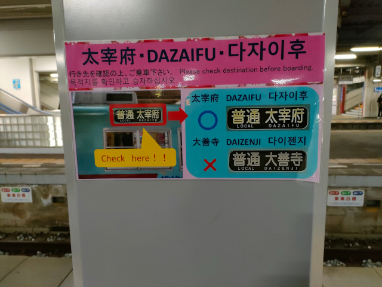
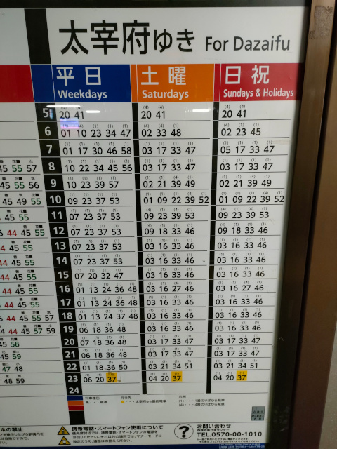
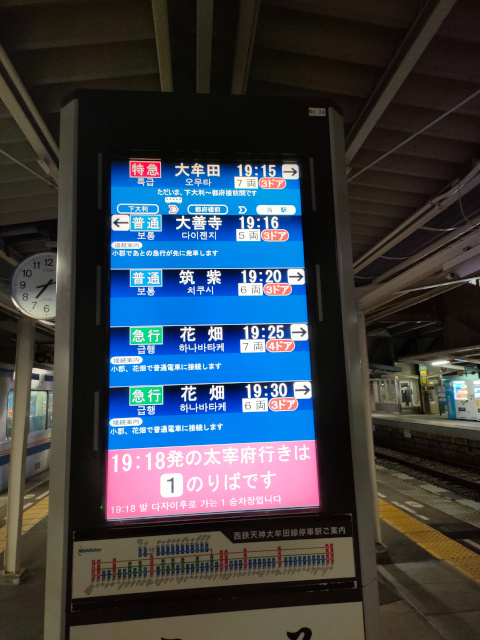
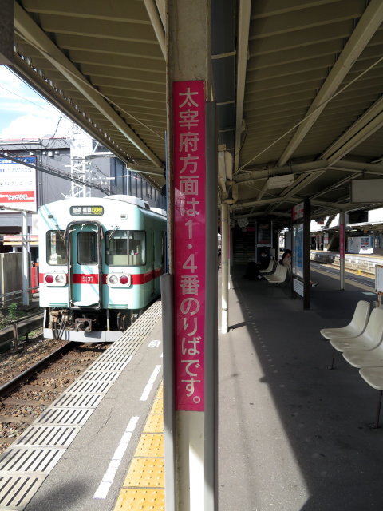
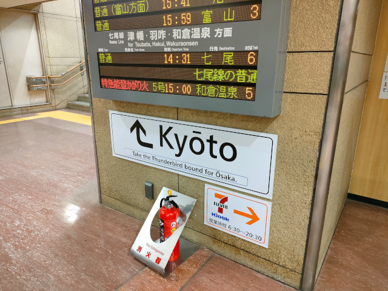

# nishitestu-dazaifu-info

## 西鉄電車・太宰府方面案内試案（西鉄二日市駅）

### はじめに：受験の季節です

世はまさに受験の季節です。今日と明日は国公立大学の二次試験が開かれています。
大学に限らず、高校受験、中学受験、医学系の国家試験もこの時期に集中しています。
国家試験監督のアルバイトをしていた時に2週続けて会った、会場監督の九州厚生局の若い兄貴は元気でしょうか。

それはさておき。

### 福岡市中心部から太宰府への来訪ルート

太宰府天満宮は学問の神様と崇められる天神さま・菅原道真をお祀りしており、年明けから3月までは受験生やその家族、
学校や予備校の先生が合格祈願のために多数参拝します。
それに加え、最近は外国から来た観光客で年中混み合うようになってアワアワしています。なんでこんなに多いんや。

福岡市中心部から太宰府天満宮へは3通りのルートがあります。

1. 西鉄電車 …… 福岡（天神）駅から、直通の急行列車か二日市乗り換えで太宰府駅へ行く。
2. 西鉄バス …… 博多駅横の博多バスターミナルから太宰府行のバス「太宰府ライナー『旅人』」に乗る（太宰府バス停は太宰府駅正面）。
3. JR …… 博多駅から鹿児島本線で二日市、そこから西鉄の紫駅まで徒歩5分 or 西鉄の二日市駅まで徒歩10分、そして西鉄電車で太宰府へ。

このうち、外国からの観光客に超人気なのが2.の西鉄バス乗り換えなしルートです。
3.もわりといて、西鉄の紫駅から上り電車に乗ってくる観光客が最近目立ちます。
王道の西鉄電車ルートはもちろん国の内外の観光客に圧倒的に利用されています。
本日の議題はこの王道ルートです。

### 西鉄二日市駅お客さん乗り間違え多発問題

西鉄電車で太宰府へ行く際は、基本的に西鉄二日市駅での乗り換えが必要です。現行の平日ダイヤの午前に2本、土曜ダイヤと日祝ダイヤの午前に6本、
福岡（天神）駅から太宰府行の直通の急行列車が出ています<a href="#footnote1">※1</a>が、
それ以外の直通列車は車両運用の都合上設定されている普通列車1本か2本しかありません。

西鉄二日市駅での乗り換えは、昔からお客さんにとっては難関でしたし、今も難関です。

* 太宰府行が2つの離れた乗り場（1番乗り場・4番乗り場）から交互に出ていた時期が長かった。
    * 10年前に日中の福岡～太宰府の普通列車を二日市で系統分割して乗り場が1番乗り場にほぼ統一されましたが、直通急行ほか数本が4番乗り場発着となっています。
    * まだ乗り場が分かれているため、駅の固定の案内看板も「太宰府方面は1・4番乗り場です。行先・乗り場を（発車案内表示で）ご確認ください」と少々歯切れが悪くなっています。
* 行先表示の見た目があまりにも似過ぎている列車がやって来る（今も）。
    * 「<ruby>大善寺<rp>（</rp><rt>だいぜんじ</rt><rp>）</rp></ruby> (DAIZENJI)」
      「<ruby>太宰府<rp>（</rp><rt>だざいふ</rt><rp>）</rp></ruby> (DAZAIFU)」
      「<ruby>大牟田<rp>（</rp><rt>おおむた</rt><rp>）</rp></ruby> (ŌMUTA)」
      の3種類の行先が二日市駅にやってきます。時間帯によっては同じホームに来ます。
    * 漢字に初めて出くわす外国人観光客が往生し、頼りのローマ字表記も似ているのでダメですし、何より日本人観光客も結構間違えています。
    * 厄介なことに、歴史上の朝廷の機関やその史跡を示す際に用いる表記
     「<strong style="color:red;">大宰府</strong>」（読みは「だざいふ」、一文字目が「大」）がありますし、
      漢字変換入力時に混同して掲載している観光案内のWebサイトも数多く存在しているため、外国の人には「大」と「太」の区別も難しくなっています。
* 『太宰府』と大書された太宰府観光列車『旅人』編成（3000形3010編成）が間合い運用で太宰府と無関係の運用に入る。
    * 編成数削減等による車両系統（車両運用）統廃合により、太宰府線運用およびその送り込みと無関係の列車への充当が増えています。

初めて来るお客さんだと、間違えずに乗り換えられたらもう賞賛ものです。天神さまのお導きかもしれません（？）

一般の鉄道好きからは「案内をよく見ろ」との一般論が出てくるのが相場です（よく見ます）が、
沿線居住通算30年の自分が「こりゃ間違えるじゃろ」と言うんだから注意力うんぬんで片付けようにもどうにもなりません。ダメです。 ~~異論は認めません。~~
最終的に困るのは客だけではなく、乗り間違いに気付いた客が相談に来る朝倉街道駅（二日市からだと太宰府までと同じ2駅先）の駅員さんもなので。

西鉄もあまりもの間違いの多さに困り果てたのか、昨年あたりに（おそらく秋から）下記のような掲示が出ました。
ようやく出たかという感じでしたが、結局はそっくり度90パーセント（自作カンピューター演算による）の『絵<a href="#footnote2">※2</a>』
を見分けろという無理難題ですので、効果は思ったほどに出ていないかもしれません。

ホームにある時刻表では、太宰府行については乗り場の番号つきで案内がされています。
実は太宰府行の乗り場は<strong class="highlight">基本的に1番乗り場に統一されており</strong>、4番乗り場から出るのは朝の一番手の列車から4本目（日祝ダイヤでは3本目）までと、
午前中にある福岡から直通の太宰府行急行だけです。急行は太宰府線内は各駅に停車するため普通列車と同様に扱われ、時刻表示も黒となっています。

「これを見ればいいのでは？」と思う向きもいるかもしれませんが、外国の人には分からないと思います。肝心の凡例が日本語でしか書かれていないので。
現に効き目がないから間違いが発生しているのであって、一見さん（太宰府を頻繁に訪問する観光客はそういないと思われるので）を呵責しても仕方ありません。

ちなみに西鉄二日市駅にはきちんと発車標（列車の出発案内板）が備え付けられ、液晶画面表示により案内がされています。
発車標があるホームと異なるホームから出る列車は下の段に強調表示され、太宰府行は特別にピンクの背景色で表示されます。
外国語表示はその欄の最も下に小さく出ます（英語・韓国語・中国語（簡体字）の3か国語表記）。

「これだけ書いてあって間違えるなんて」と思う人もいるかもしれませんが、間違える人が多いということは、間違いを誘発する条件を取り除ききれていないということです。
間違えて困るのが客だけなら十歩ほど譲って「バカヤロウ目ン玉をあと百個つけてこいッ！」と喝を入れるだけでいいかもしれませんが、朝倉街道駅の駅員さんが目を回しているのでダメです。
労務改善を実施しなければなりません。案内改善・強化を渋ったり反対する人がもしいたら「よしお前が朝倉街道駅の窓口の横に立っとけ。日当は駅員さんと一緒な？」です。

### 行先表示を派手にしてみる案

間違える可能性を減らすには、太宰府行きの電車を見分ける手段を増やすのがひとつの策です。
2014年3月22日ダイヤ改正で登場した「太宰府観光列車『旅人』」とその専用編成（8000形8051編成→3000形3010編成）はその識別に一役買っているものと思われます。
ただ、太宰府線が毎時4本ある一方、専用編成を入れられるのは毎時2本に限られるため、一般編成が入る方の列車の区別はやはり難しいです。

そこで考えたのが、列車の行先表示をド派手にしてみる案です。まずは方向幕搭載車向けに次の2つを用意しました。

1枚目は、かつて西鉄で活躍した1000形（2001年3月引退）の方向幕で採用されていた「普通 太宰府」のコマデザインを模して梅のマークを入れ、
さらに区別をつけるために背景色を標準の黒から薄い赤にしました。
背景色の色系統は西鉄バス博多駅～太宰府線「太宰府ライナー『旅人』」の方向幕背景色に寄せて、少し色相をずらしています。
5000形・6000形・6050形のような種別・行先一体型の方向幕への利用を考えた案です。

2枚目は、種別表記を丸ごと梅のマークに置き換えたものです。
現行ダイヤにおける太宰府行が、直通急行と車両運用上設定されている福岡発着の1～2本を除いてすべて二日市～太宰府間の線内完結となっており、
全列車が各駅に停車することから種別表記そのものを置き換えました。
こちらですと、3000形・7000形・7050形の種別・行先分離型の方向幕の場合も、梅マークを種別幕に入れることで採用できます。

フルカラーLEDの行先表示装置を導入している9000形であれば、太宰府行のLEDパターンに梅のマークを入れるのが良いかと思います。
LED表示のドットマトリクスを再現する腕~~と我慢強さ~~がないため、そちらは有志にデザインをお任せします。

### ホームの案内を大胆に省略する案

現在もなお太宰府行の発車ホームが統一できずまだ乗り場が分かれているため、駅にいくつかある固定の案内看板は、
四か国語表記となっているものもありつつも「太宰府方面は1・4番乗り場です。行先・乗り場を（発車案内表示で）ご確認ください」と少々歯切れが悪くなっています。
写真のものはシンプルなものですが、多言語表記のものは小さい文字で延々と説明されています。~~読めねえよ。~~

そこで、情報をばっさり削って、このくらいに簡略化したものをホームや跨線橋に突き立てたらどうかなと思いました。これは自分独自のアイデアではなく、
JR西日本が金沢駅で導入している京都方面への案内看板にヒントを得たものです。（下記写真）

4番乗り場発車の数が多くて歯切れが悪いのは相変わらずですが、昼間時間帯の分の着発線統一は頑張ってもらうことにします。朝は観光客が使わないのでいいです。

### 結び

このアイデアはご自由にご利用ください。
別にタダでもいいですが、それでは示しがつかない、あるいは契約管理上不都合があるならば、アイデア料として金一封を頂く形の契約とするのもやぶさかではありません。
お待ちしております（？）

* * *

余談

<ol id="footnotes">
    <li id="footnote1">正月三が日（1月1日～3日）に施行される正月ダイヤですと、9時台～16時台に30分間隔で福岡（天神）～太宰府間の臨時急行『初詣号』が30分に1本、上下両方向に運転されます。</li>
    <li id="footnote2">非漢字圏の方にとって漢字は絵に見えるとのことです。エキゾチック・グラフィカル・キャラクターことジャパニーズ・KANJIです。</li>
</ol>
