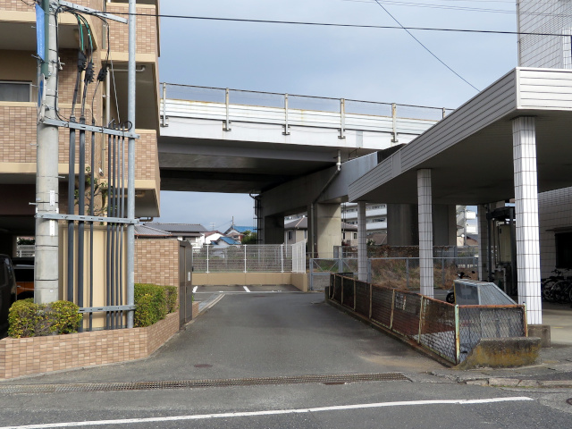
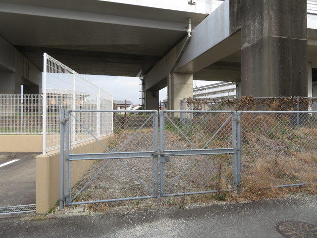
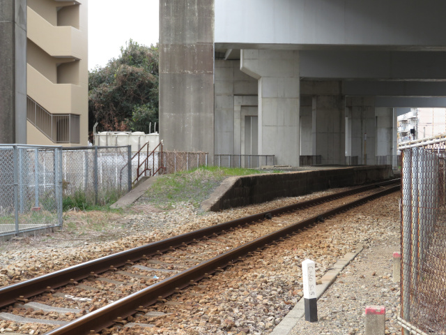
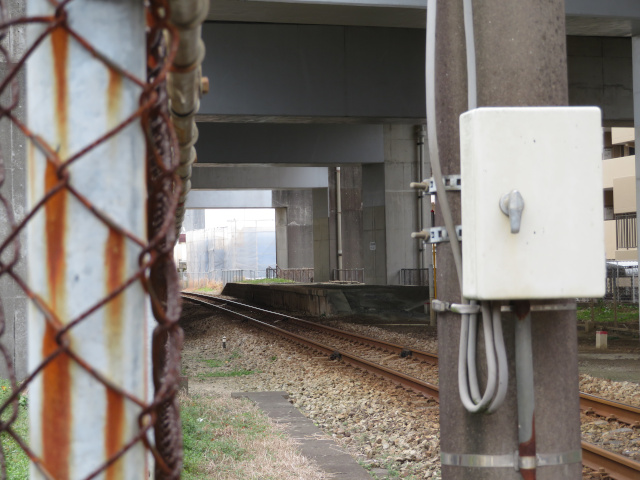
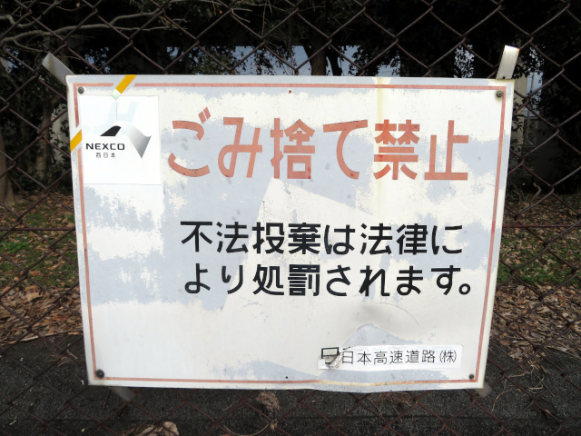

# past-chikugo-ogori-sta-2025

## 旧国鉄筑後小郡駅跡訪問（2025年）

個人サイトのブログ風ページを更新せず、別のページやSNSばかり更新している昨今ですが、今回はちょうどよい感じの題材になりました。年休を取って役所や銀行関係の用事を済ませたついでに、地元の鉄道遺構ともいうべき旧国鉄・筑後小郡駅跡を久々に訪問しました。

### 国鉄甘木線→甘木鉄道甘木線概説

小郡市の中央付近を東西に走る甘木鉄道甘木線は、かつては国鉄（現在のJR）の甘木線でした。国鉄時代の末期は1日7往復が走る（うち朝の上り1本は鹿児島本線直通の甘木発博多行）だけの赤字ローカル線と化しており、第1次特定地方交通線に指定されて、廃止するか、国鉄以外の事業者によって鉄道を運営するか協議が行われました。当時の甘木市（現在の朝倉市）の商工会を中心とした沿線自治体や沿線住民の鉄道存続の熱意により、当初は存続に後ろ向きだった我らが小郡市も翻意させ、沿線自治体（とキリンビール）を出資者とする第三セクター・甘木鉄道が設立され、1986年（昭和61年）4月1日に甘木鉄道甘木線として再出発しました。

### （旧）筑後小郡駅について

国鉄から甘木鉄道への経営移管時に行われた施策のひとつに、筑後小郡駅の移転がありました。もともと小郡市内には筑後小郡・筑後松崎の2駅が設置されており、筑後小郡駅は西鉄小郡駅から道のりで約450mほど西に離れた場所にありました。それを経営移管のタイミングで駅を400m東の築堤上、西鉄との立体交差地点すぐ西側に移転し、同時に旧国名を冠さない「小郡駅」に改称しました。駅移転により、西鉄小郡駅との間の乗り換え移動距離は約150m、約3分に短縮されました。

移転に際して、移転前の駅施設については完全には撤去されず、ホームとホーム上の待合スペース構造物（ベンチ上屋）が残されました。そっくりそのまま残ったわけではなく、高速道路工事にあたって元のホーム（約120m）のうち西側半分を撤去し、残る東側半分については工事の妨げになる部分をゴリゴリ削り（ホーム上ベンチ上屋後から西側）、さらに甘木鉄道への移管まで不足する長さ分を東側に仮設の狭いホームとして延ばしておいたものの、工事終了後に残存していた元ホーム部分を壊してしまうことなく、もはや使う予定がないにもかかわらず、一時的に削っていた幅の部分だけはほぼ元通りに作り直してしまったようです。それゆえ、遺構半分・復元オブジェ半分といえるかもしれません。

地元有識者の話によれば、1985年頃に大分自動車道の工事が直上部で始まった頃に一部仮設化され、その工事期間中に駅自体が移転してしまったものの、1987年（昭和62年）2月5日の大分自動車道開業（鳥栖～朝倉間）後に再建（一部修復）されたそうです。なぜそのようになってしまったかは、当時の国鉄と日本道路公団の契約を参照するよりほかありません。当時の乗客の方が撮影された国鉄甘木線の最後の列車の沿線風景映像がYouTubeに掲載されており、4分05秒～4分25秒付近が筑後小郡駅仮駅・筑後小郡駅旧駅（現在の遺構）となっています。

1. [YouTube - 国鉄甘木線の車窓　基山行　昭和61年](https://www.youtube.com/watch?v=6fQ2-XNDClM)
2. [筑後小郡駅仮設ホームに関する有識者情報 (Twitter - こーとるさんのツイート)](https://x.com/kowtr_tw/status/769722772901601280)
3. [Amebaブログ - がんばれない @ 元∶旅師！の行き当たりばったり。。（Ｔｒａｖｅる）：旅(677-追録1.5)：国鉄 甘木線（全駅掲載）(1985.02.11)](https://ameblo.jp/matuzawamay/entry-12161324106.html)

3番目のブログ記事にある写真（1985年2月11日撮影）は、長らく残っていたホーム上の待合スペースがそのまま写っていて、さらにその手前（基山方）に非常に新しい駅名標が建てられているのが写っています。

ある時期までは出入り口の階段通路から自由に出入りできていたようですが、のちに扉式のフェンスにより閉鎖されて現在に至ります。

### 略年表

筑後小郡駅関係の構造物が、駅移転直前から現在までにどのようになったかの略年表は次のとおりです。

| 年月                       | 状況                                                                                                                                 |
|----------------------------|--------------------------------------------------------------------------------------------------------------------------------------|
| 1981年（昭和56年）10月15日 | この日撮影の空中写真（国土地理院）に駅舎の姿あり。                                                                                   |
| 1983年（昭和58年）3月      | インターネット上にこの時期撮影の駅舎写真あり。                                                                                       |
| 1985年（昭和60年）初頭頃   | この頃までは駅舎があったとの情報あり。                                                                                               |
| 1985年（昭和60年）2月11日  | 駅舎の姿が消え、ホーム上にベンチ上屋が存在、妙に新しいホームと駅名標あり。                                                           |
| 1985年（昭和60年）5月16日  | この日撮影の空中写真（国土地理院）には<b>駅舎の姿なし</b>。                                                                          |
| 1985年（昭和60年）後半？   | 大分自動車道工事に伴い、既設ホームを撤去し仮設化。                                                                                   |
| 1986年（昭和61年）4月1日   | 国鉄から甘木鉄道に移管。 筑後小郡駅を400m東に移転して小郡駅に改称。旧駅施設は使用されなくなる。                                   |
| 1987年（昭和62年）2月5日   | 大分自動車道：鳥栖JCT～朝倉IC間開業。 この時期以降に筑後小郡駅跡のホームが再建されたとの情報あり。                                |
| 2015年（平成27年）11月15日 | <a href="https://x.com/Ngtr_commoral/status/665795989333151744">この日撮影のネット上の投稿写真</a>ではまわりや屋根のトタン板が存在。 |
| 2016年（平成28年）7月      | <a href="https://tetsudo-ch.com/32772.html">この日撮影のネット上の記事</a>では、まわりや屋根のトタン板が消失。骨組みだけとなる。     |
| 2018年（平成30年）1月26日  | <a href="https://x.com/fuekona1025/status/956816101949587457">この日撮影のネット上の投稿写真</a>では骨組みが引き続き存在。           |
| 2019年（平成31年）1月6日   | <a href="https://www.flickr.com/photos/kowtr/39663017213/">ホーム上構造物が完全に撤去された状態の投稿写真</a>あり。                  |

### 2025年1月27日の現況

<section class="photo-area">
    
    <section class="photo-description">
        

        旧・国鉄筑後小郡駅の駅舎跡地には立派なマンションが立っています（写真左手）。マンションの正面だけ道の形が若干変わっていて、古い航空写真との比較で、そこがちょうど駅舎の前あたりであったとわかりました。周辺に駅跡であることを示す石碑や看板は特にありません。
        

    </section>
    
    <section class="photo-description">
        

        駅ホームへ行ける階段の手前には開閉可能な扉式のフェンスがあり、施錠されています。旧駅舎位置を基準とすると東側（甘木方）にあります。
        

    </section>
    
    <section class="photo-description">
        

        写真や証言を照合すると、この階段は1985年初頭までに駅舎を解体した時に作られたものである可能性があります。
        

    </section>
    
    <section class="photo-description">
        

        線路すぐ北側の道を端まで進むと、ホームがよく見えます。高架下にあるためか、今も大変綺麗に整っています。（写真との比較で、1985年の駅舎解体のタイミングの直近1～2年内に修復したように見えるため、そうなると作られてからは40年ほどということになります。）
        

    </section>
    
    <section class="photo-description">
        

        ホームの西側、古祇園踏切からホームの方を見ます。現在はホームの端まで結構離れていますが、1981年頃の航空写真によると、この踏切相当の位置までホームが延びているのが分かりました。（当時は古祇園踏切はありませんでした。）Googleマップ等で位置を合わせて新旧のホーム長を計測すると、元が約120m（20m級車両で6両分）、現存するものが約60m（20m級車両で3両分、15m級の甘木鉄道初代のAR100形であれば約4両分）となっています。
        

    </section>
</section>

他の方が列車内から撮影された写真によれば、ホームが高速道路の橋脚にかかる部分では、ホームを綺麗に切り欠いて、その部分をコンクリート擁壁でその形通りに固めてあるのが分かりました。その写真の時期とコンクリートの色から、橋脚修繕工事と同時期に修繕施工されたと見受けられ、少なくとも当分の間はホームをそのまま維持する意志があると見て取れます。

### 1985年時点でのホーム改修の謎

移転してしまった後の駅ホームのうち、工事にあたって撤去せず、幅だけを削っていた部分が綺麗に再建された理由はよく分かりません。やはり国鉄と日本道路公団の契約によって原状回復がなされた説が有力そうです。しかし、原状回復工事が特に何らかの変更や一部差し止めも行われなかった理由や、そもそも1985年の直近1～2年の時点で古い駅名標を使い延ばさず、大変真新しい駅名標が置かれてしまった理由もよく分かりません。筑後小郡駅の移転改称がいつ決まったかが鍵になりそうです。

### おまけ

<section class="photo-area">
    
    <section class="photo-description">
        

        筑後小郡駅跡近くの高速道路のフェンスには「ごみ捨て禁止」の看板がありますが、日本道路公団時代からのものを上からシールで修正して使われ続けています。透けて見える「JH」ロゴと公団ゴシックが良い感じです。
        

    </section>
</section>

