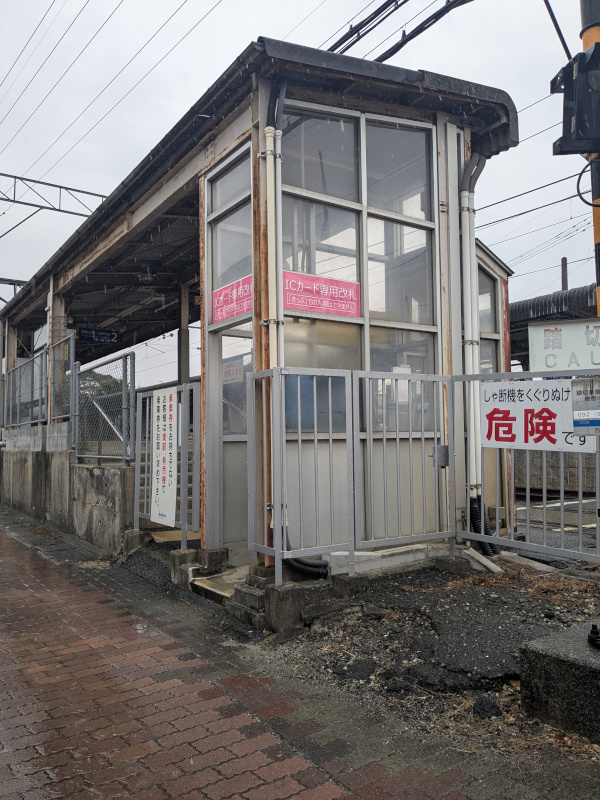

# tsuko-sta-gate-renewal

## 津古駅西口改札機更新工事記録

### 津古駅のあらまし

西鉄天神大牟田線における我が最寄駅、三国が丘駅の1つ北に、津古（つこ）駅という普
通列車のみが停車する駅があります。ホームが5両分しかなく、6両編成以上の列車が停
車する時は福岡（天神）方1両のドアカット（扉を閉めたままとする取り扱い）をする、
やや小さめの駅です。駅前の道は非常に狭く、駅舎や駅出入口も非常にこぢんまりとし
ています。

津古駅の駅事務室や自動券売機・自動改札機等は線路の東側、1番乗り場（下り久留米・
大牟田方面ホーム）の方にありますが、線路の西側、2番乗り場（上り二日市・福岡（天
神）方面ホーム）の方にも小さな出入口、正確には1月23日までは入口専用だった通り道
が設置されています。西側の入口は駅開業当初からあったわけではなく、2000年（平成
12年）頃に設置されたものです。同時期に同じ小郡市内の三沢駅・大保駅も、駅舎がな
い側（いずれの駅も西側）の上りホームに直結する、自動改札機だけが設置された出入
口が設けられています。

### 西口改札について

今回、この西側入口の改札機の更新工事により、1月24日から西側入口がICカード乗車券
専用の出入口に変更されました。ここには西鉄では初となる、また、全国的にもまだ珍
しい入場・出場兼用のICカード簡易改札機が設置されました。

津古駅の西口は西鉄でも類を見ないほどに手狭な立地ゆえ、2000年の西口開設時から入
口専用として運用され、自動改札機も通常のゲートを構成する機器のうち、乗車券処理
部を持つ通行方向右側1基のみが置かれていました。

現在、ICカード「nimoca」の導入からすでに20年近く経過し、磁気式乗車カード「よか
ネットカード」が廃止されて久しく、回数券も廃止されたため、乗客が事前に磁気式乗
車券を持っている場面がほとんど無くなりました。乗車券を買う場合は必ず東側の駅舎
に回ることから、わざわざ西口を通る理由はありません。磁気式乗車券処理部のメンテ
ナンスコストが大きいこともあり、今回からICカード専用の改札口としたようです。

### 改札機更新前（2025年1月22日）

※写真をクリック（タップ）すると拡大できます。

普段利用する駅の隣駅はなかなか利用することがなく、新改札機運用開始を知った次の
日、実運用開始2日前になってからの久々の訪問となりました。

<section class="photo-area-2">
    
    
    <section class="photo-description">
        

            1月22日の時点ですでに新しい簡易改札機はブルーシートに覆われた状態で設置が完了していました。外からの入口真正面に設置され、遠隔対応用インターホンと並ぶ形となっています。元々はインターホンが簡易改札機の位置にありましたが、今回の工事により向かって右側に移設された形となります。（右側・2枚目写真は2023年12月9日撮影）
        

    </section>
</section>

<section class="photo-area">
    
    <section class="photo-description">
        

        西口には、1月24日（金）に自動改札機から簡易改札機に変更になる旨の案内が掲示されていました。簡易改札機と言いつつ、ICカードの利用客にとってはここからの出場もできるようになるので、むしろ上等な改札機への変更といえるかもしれません。
        

    </section>
</section>

<section class="photo-area">
    
    <section class="photo-description">
        

        西口の全体像です。四半世紀にわたり掲げられていた色褪せた手書きの「ここからは出場できません」という看板があります。
        

        

        ちなみに、写真の通りこの上りホームから西口側への経路にはスロープがないため、車椅子等による上り列車利用の場合は、このホームの福岡（天神）方にある通用口（改札なし、通常時閉鎖）から駅係員案内により出入りすることになるかと思われます。そうした場面に居合わせたことがないので詳細な運用は不明です。
        

    </section>
</section>

* * *

### 改札機更新後（2025年2月1日）

※写真をクリック（タップ）すると拡大できます。

<section class="photo-area-2">
    
    
    <section class="photo-description">
        

        西口新改札機が運用を開始してから1週間経った2月1日（土）に津古駅を再訪問しました。改札外側の従来「入口専用」と掲げられていた位置には、ラミネート加工された紙らしきものによる「ICカード専用改札」「『きっぷ』での入場はできません」との掲示が新たに設置されました。
        

        

        改札内の方も、従来「出口」と大書されていた場所に外と同様の「ICカード専用改札」の案内が掲げられました。そして、色褪せた立て看板が撤去されていました。また、元々自動改札機があった位置は養生用のシートで覆われています。
        

    </section>
</section>

<section class="photo-area-2">
    
    
    <section class="photo-description">
        

        今回、西口側には西鉄で初となる入場・出場兼用のICカード簡易改札機が設置されました。筐体は他の主要駅改札内にあるICカードチャージ機更新工事に伴って設置された新チャージ機と似た形状で、ICカードのタッチ位置付近の角度や構造が若干違っています。
        

        

        入場・出場兼用の改札機は全国的にも導入事例がまだ少ないようで、調べられた範囲では、JR東日本が秋田地区や青森地区の一部にSuicaを導入した時（2023年5月23日供用開始）に、いくつかの駅に設置した事例が見つかりました<a href="#dual-gate-sta-list">［注釈1］</a>。
        

    </section>
</section>

この改札機は、入場と出場を区別するため、改札が反応するアラーム音（ピッ）の後に、
入場と出場のどちらであるかを音声で知らせてくれます。入場時には「入場しました」
との声が流れました。

### 今後の他駅への設置可能性

津古駅西口に入場・出場兼用のICカード簡易改札機が設置された理由の仮説として、西
口のスペースが非常に小さいこと、また、通路幅の関係上人が同時に出入りすることが
できないため、兼用の改札が実用化されたならば、わざわざ改札機を2台に分離する必要
がなかったという説が考えられます。

このタイプのものが他駅に設置されるとしたら、nimoca導入時に設置した簡易改札機群
が耐用年数を迎えた時に、小規模な駅の簡易改札機がこれで置き換えられる可能性があ
ります。

### 脚注

* 注釈1：入場・出場兼用型ICカード簡易改札機設置駅（JR東日本）
    * 秋田地区
        * 奥羽本線：和田駅、秋田駅（メトロポリタン口）、上飯島駅（下りホーム）
        * 男鹿線：出戸浜駅、上二田駅、二田駅、天王駅、船越駅、脇本駅、羽立駅
    * 青森地区：
        * 奥羽本線：撫牛子（ないじょうし）駅、大釈迦駅、鶴ケ坂駅

